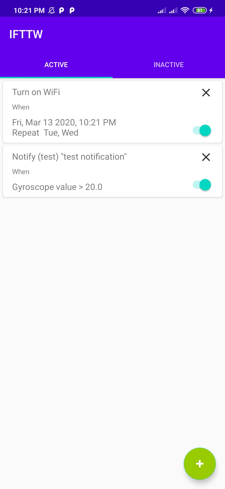
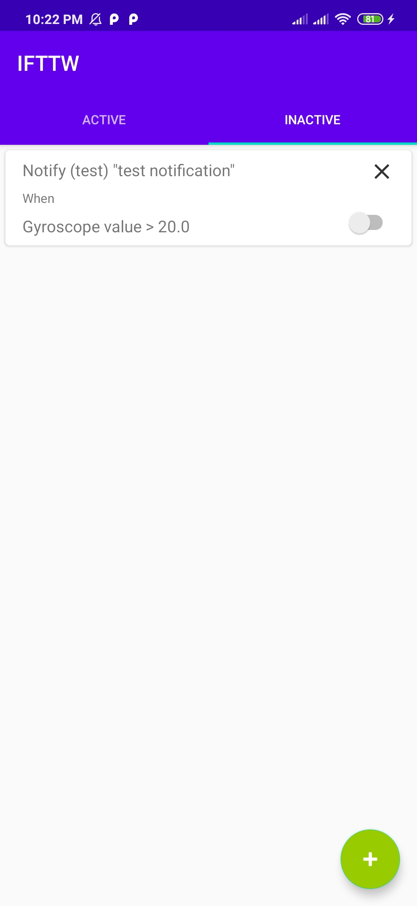
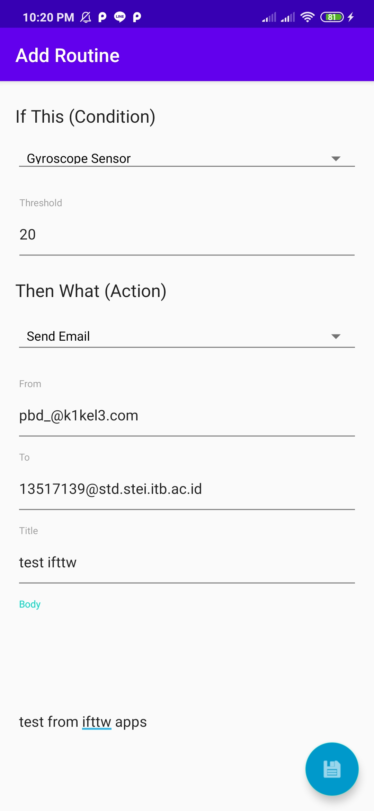
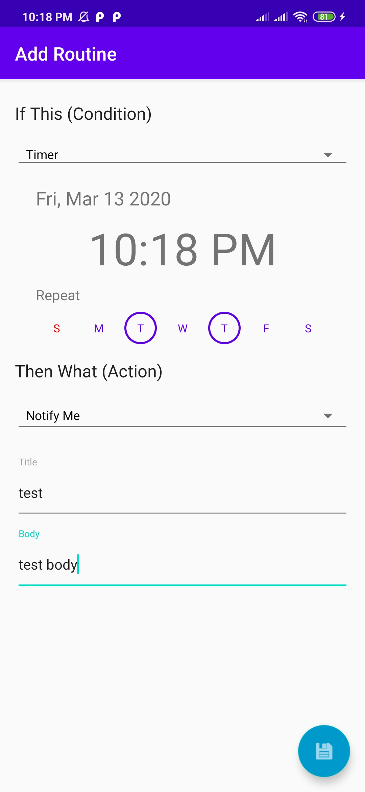
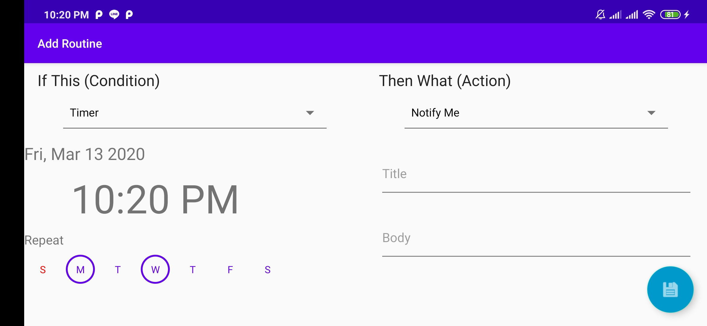

# IF3210-2020-03-Project IFTTT

## Deskripsi aplikasi
IFTTW (If This Then What?)

IFTTW adalah sebuah aplikasi yang mirip dengan IFTTT.
Fitur utama dari IFTTW adalah kemampuan penggunanya untuk membuat berbagai routine.
Suatu routine terdiri dari tepat satu kondisi dan satu aksi. Jika suatu kondisi
tertentu dipenuhi (misalnya, sekarang pukul 11.00), aksi yang terhubung dalam 
routine tersebut akan dijalankan (misalnya, pengguna diberi notifikasi).
Kondisi dan aksi adalah sebuah modul yang berbeda dan terpisah satu sama lain, 
sehingga suatu kondisi bisa digunakan dalam banyak routine (terhubung dengan aksi
yang berbeda). Suatu modul bisa digunakan dalam banyak routine.

## Cara kerja, terutama mengenai pemenuhan spesifikasi aplikasi

Aplikasi pada awalnya akan menampilkan list routine yang pernah dibuat sebelumnya. List routine ini dibagi menjadi 2 tab yaitu **Active** dan **Inactive**. 

Tiap routine berupa card yang bisa dikenakan 2 aksi oleh user, hapus dan set apakah dia aktif / tidak. Mengahpus routine dilakukan dengan mengklik tombol **X** di atas kanan card. Mengubah status aktif/tidak dilakukan dengan menekan *switch* yang berada di kanan tengah card. 

Jika ingin menambahkan routine baru, user bisa mengklik tombol **+** yang berada di bawah kanan. Ketika diklik, akan dibawa ke menu pembuatan routin dimana user harus memilih kondisi & aksi yang diinginkan.

Kondisi yang kami sediakan adalah :
- Timer :
    - Menyala pada jam tertentu di suatu tanggal
    - Menyala pada jam tertentu di hari hari tertentu setiap minggunya mulai dari suatu tanggal
    - Menyala pada jam tertentu setiap hari mulai dari suatu tanggal
- Gyroscope :
    - Menyala saat nilai gyroscope melebihi suatu batas *threshold*

Jika memilih **Timer**, user akan bisa memilih **tanggal mulai cek kondisi** , **jam routine aktif** , **hari aktif**. Jika semua hari dipilih, maka routine akan aktif setiap harinya. 

Jika memilih **Gyroscope**, user bisa memasukan nilai batas dari gyroscope tersebut. 

Sementara untuk aksi yang kami sediakan adalah :
- Notify Me
- Turn on Wifi
- Turn off Wifi
- Send Email

**Notify Me** adalah aksi membuat suatu notifikasi jika kondisi yang diberikan telah terpenuhi. User bisa memasukkan judul dan isi notifikasi. Notifikasi yang dibuat juga akan dikelompokkan menjadi 1 group sehingga notifikasi yang belum dilihat oleh user (belum di swipe / klik) akan terlihat seperti 1 notifikasi dari aplikasi IFTTW (bisa di expand untuk melihat semua notifikasi). 

**Turn on Wifi** dan **Turn off Wifi** adalah aksi untuk menyalakan dan mematikan wifi pada smartphone user.

**Send Email** adalah aksi mengirim email menggunakan **SendGrid API**. User bisa memasukkan email pengirim, email tujuan, judul, isi email dan kemudian ketika kondisi terpenuhi maka email tersebut akan dikirim secara automatis. 

Setelah selesai memilih aksi dan kondisi, user bisa mengklik tombol save di pojok kanan bawah, kemudian aplikasi akan menyimpan data routine tersebut dalam database dan routine tersebut akan dinyalakan.

## Library yang digunakan dan justifikasi penggunaannya
- **Room** : Library bawaan android hasil abstraksi dari **SQLite**. Kami menggunakannya karena bagi kami **Room** lebih mudah digunakan dibandingkan **SQLite** dan di spesifikasi dikatakan bahwa boleh menggunakan library apapun untuk menulis / membaca data pada **SQLite**
- **Volley** : Library bawaan android untuk mengirim request ke URL. Kami menggunakannya untuk mengirim **POST** request ke **SendGrid API**.

## Screenshot aplikasi

### Active Routine

### Inactive Routine

### Condition: Gyroscope; Action: Email API (sengrid)

### Condition: Timer; Action: Notify Me

### Landscape view Condition Action Module

